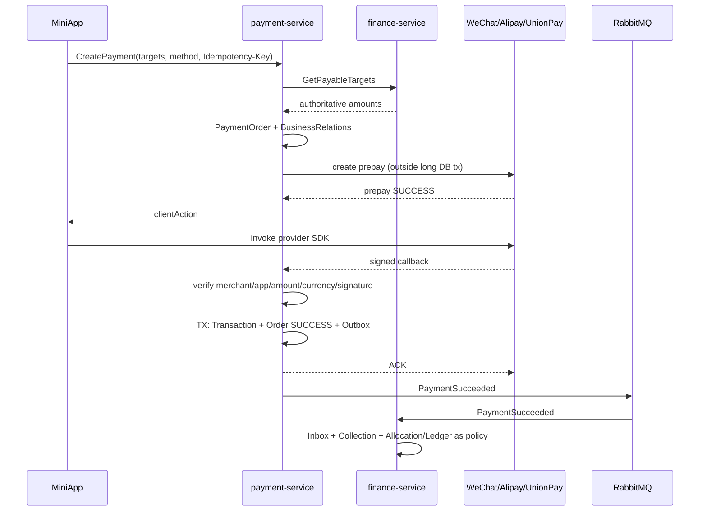
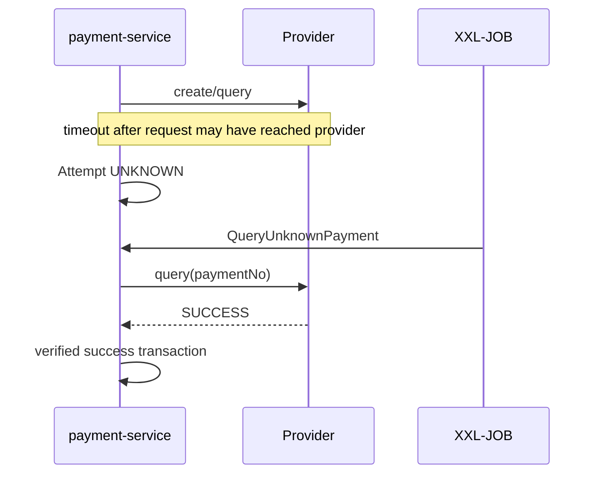
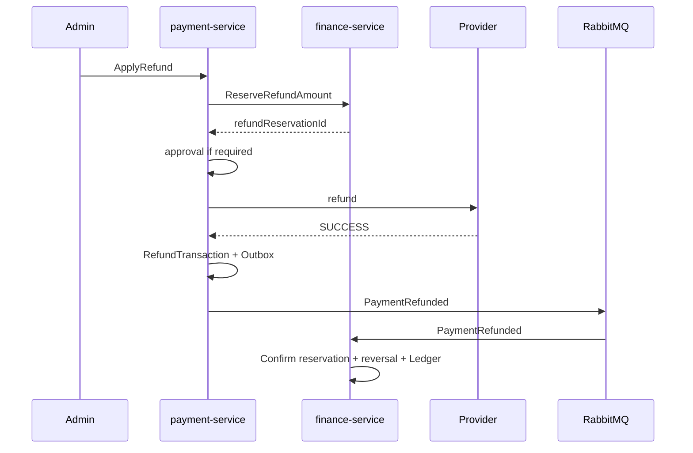

# Payment Sequence Examples — V6.3

## 1. Normal Payment

```mermaid
sequenceDiagram
  participant C as MiniApp
  participant P as payment-service
  participant F as finance-service
  participant W as WeChat/Alipay/UnionPay
  participant MQ as RabbitMQ

  C->>P: CreatePayment(targets, method, Idempotency-Key)
  P->>F: GetPayableTargets
  F-->>P: authoritative amounts
  P->>P: PaymentOrder + BusinessRelations
  P->>W: create prepay (outside long DB tx)
  W-->>P: prepay SUCCESS
  P-->>C: clientAction
  C->>W: invoke provider SDK
  W-->>P: signed callback
  P->>P: verify merchant/app/amount/currency/signature
  P->>P: TX: Transaction + Order SUCCESS + Outbox
  P-->>W: ACK
  P->>MQ: PaymentSucceeded
  MQ->>F: PaymentSucceeded
  F->>F: Inbox + Collection + Allocation/Ledger as policy
```

## 2. UNKNOWN Recovery

```mermaid
sequenceDiagram
  participant P as payment-service
  participant W as Provider
  participant J as XXL-JOB

  P->>W: create/query
  Note over P,W: timeout after request may have reached provider
  P->>P: Attempt UNKNOWN
  J->>P: QueryUnknownPayment
  P->>W: query(paymentNo)
  W-->>P: SUCCESS
  P->>P: verified success transaction
```

## 3. Refund

```mermaid
sequenceDiagram
  participant A as Admin
  participant P as payment-service
  participant F as finance-service
  participant W as Provider
  participant MQ as RabbitMQ

  A->>P: ApplyRefund
  P->>F: ReserveRefundAmount
  F-->>P: refundReservationId
  P->>P: approval if required
  P->>W: refund
  W-->>P: SUCCESS
  P->>P: RefundTransaction + Outbox
  P->>MQ: PaymentRefunded
  MQ->>F: PaymentRefunded
  F->>F: Confirm reservation + reversal + Ledger
```
